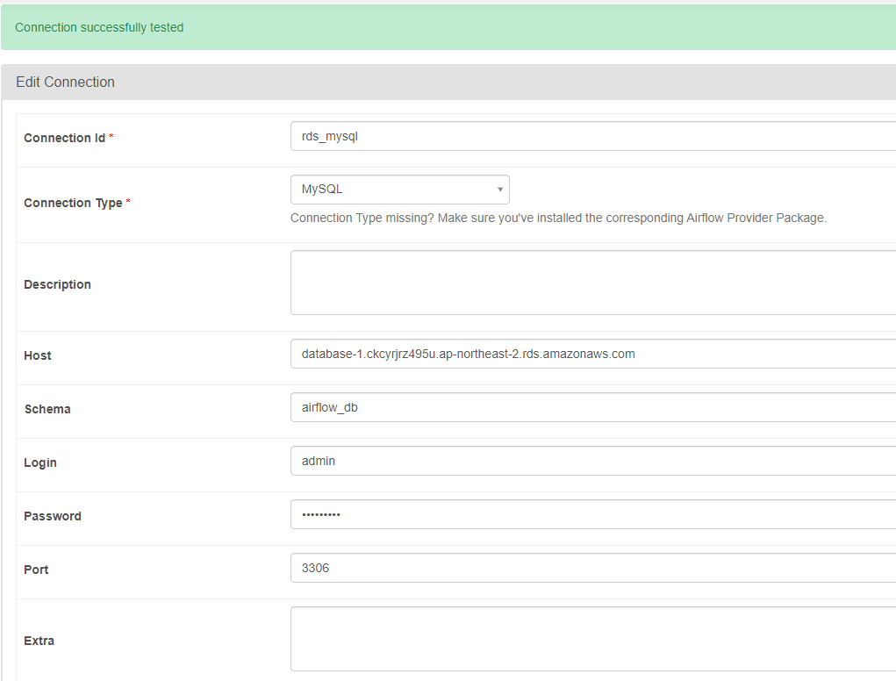
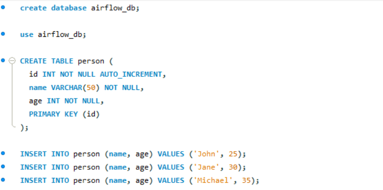
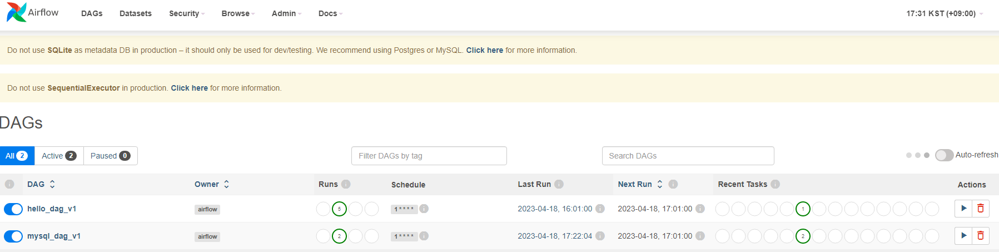
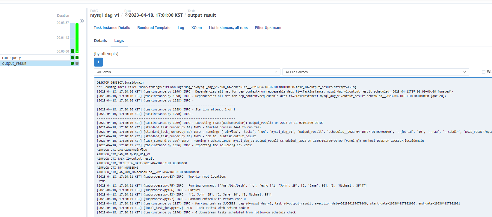

## Mysql 연결

**1. Mysql 연결을 위한 패키지 설치**

```bash
pip install apache-airflow[mysql]
```

  - WSL 환경에서 `mysql_config`와 `mariadb_config`를 찾을 수 없다는 에러가 발생하여 MySQL 또는 MariaDB의 클라이언트 라이브러리를 설치해야했다.
      ```bash
      sudo apt-get update
      sudo apt-get install default-libmysqlclient-dev
      ```

**2. Airflow UI에서 `Admin` -> `Connections` -> `+` 버튼을 클릭하여 연결 정보를 입력한다.** 

- DB 정보 입력하고 연결을 테스트한다. 

- 테스트를 위해 mysql에 접속하여 데이터베이스와 샘플 데이터를 입력한다. 이때 schema로 설정한 값은 mysql에서 사용할 데이터베이스이다. 
 

**3. dag 작성**
- 아래의 dag 파일을 `~/airflow/dags` 폴더 아래에 저장한다.

```python
import pendulum
from airflow import DAG
from airflow.providers.mysql.operators.mysql import MySqlOperator
from airflow.operators.bash import BashOperator
from datetime import datetime, timedelta


with DAG(
    dag_id="mysql_dag_v1",
    schedule_interval='1 * * * *',
    dagrun_timeout=timedelta(minutes=1),
    start_date=pendulum.datetime(2023, 4, 17, tz="Asia/Seoul"),
    max_active_runs=1,
    max_active_tasks=1,
    catchup=False
) as dag:

    # 실행할 sql 문
    sql_query = "SELECT * FROM airflow_db.person"
    
    # MySqlOperator 정의
    mysql_operator = MySqlOperator(
        task_id='run_query',
        mysql_conn_id='rds_mysql',
        sql=sql_query,
        dag=dag
    )
    
    # 결과를 출력하는 bash opeartor
    output_result = BashOperator(
        task_id='output_result',
        bash_command='echo {{ ti.xcom_pull(task_ids="run_query") }}',
        dag=dag
    )
    
    # 작업 실행 순서
    mysql_operator >> output_result

```

**4. 결과 확인**

- 스케줄러에 의해 dags 폴더에 저장된 dag는 자동으로 DAGs 파이프라인에 업로드된다. 

- 작업이 성공적으로 실행되면 output_log에서 결과를 확인할 수 있다.
