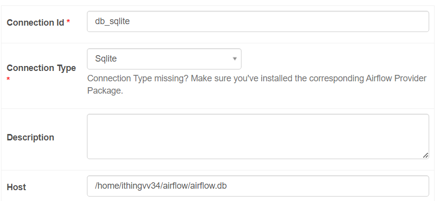

### NFT 파이프라인 프로젝트

- https://api.opensea.io/의 nft 토큰 정보를 api로 받아 데이터베이스에 저장하는 etl 실습 프로젝트

**구조**

1. 테이블 생성
2. API 확인
3. NFT 정보 추출
4. NFT 정보 가공
5. NFT 정보 저장
   
**1.테이블 생성**

**`sqlite_conn_id='db_sqlite'`**
- Connection에서 db_sqlite 설정을 추가한다.
 

```python
import json
from datetime import datetime
from airflow import DAG
from airflow.providers.sqlite.operators.sqlite import SqliteOperator

default_args = {
  'start_date': datetime(2023, 1, 1),
}

with DAG(dag_id='nft-pipeline',
         schedule_interval='@daily', # 주기 지정
         default_args=default_args, 
         tags=['nft'],
         catchup=False) as dag:
  
  creating_table = SqliteOperator(
    task_id='creating_table',
    sqlite_conn_id='db_sqlite',
    sql='''
      CREATE TABLE IF NOT EXISTS nfts (
        token_id TEXT PRIMARY KEY,
        name TEXT NOT NULL,
        image_url TEXT NOT NULL
      )
    '''
  )
```

2. API 확인

**`http_conn_id='opensea_api'`**
- api 연결을 위해 http 커넥션을 설정한다.


```python
from airflow.providers.http.sensors.http import HttpSensor

is_api_available = HttpSensor(
    task_id='is_api_available',
    http_conn_id='opensea_api',
    endpoint='api/v1/assets?collection=doodles-official&limit=1'
  )
```

3. NFT 정보 추출

[https://api.opensea.io/api/v1/assets?collection=doodles-official&limit=1]()
- 위의 url에 GET 요청으로 response를 받아온다.

```python
extract_nft = SimpleHttpOperator(
    task_id='extract_nft',
    http_conn_id='opensea_api',
    endpoint='api/v1/assets?collection=doodles-official&limit=1',
    method='GET',
    response_filter=lambda res: json.loads(res.text),
    log_response=True
  )
```

4. NFT 정보 가공

- SimpleHttpOperator 로 가져온 정보를 처리하는 task
- 상위 task로 부터 xcom_pull을 사용하여 데이터를 전달받음

```python
def _processing_nft(ti):
    assets = ti.xcom_pull(task_ids=['extract_nft'])
    if not len(assets):
        raise ValueError("assets is empty")
    nft = assets[0]['assets'][0] # nft asset

    processed_nft = json_normalize({
        'token_id': nft['token_id'],
        'name': nft['name'],
        'image_url': nft['image_url'],
    })
    processed_nft.to_csv('/tmp/processed_nft.csv', index=None, header=False)
```

- python 작업을 위한 PythonOperator 사용
```python
  process_nft = PythonOperator(
    task_id='process_nft',
    python_callable=_processing_nft
  )
```

5. NFT 정보 저장
   
- BashOperator 를 이용해서 bash 커맨드를 통해 추출한 csv 데이터를 sqlite db에 저장한다.

```python
store_nft = BashOperator(
    task_id='store_nft',
    bash_command='echo -e ".separator ","\n.import /tmp/processed_user.csv users" | sqlite3 /home/ithingvv34/airflow/airflow.db'
  )
```

6.task 의존성 설정

```python
creating_table >> is_api_available >> extract_nft >> process_nft >> store_nft
```

- 최종코드
```python
import json
from datetime import datetime
from airflow import DAG
from airflow.providers.sqlite.operators.sqlite import SqliteOperator
from airflow.providers.http.sensors.http import HttpSensor
from airflow.providers.http.operators.http import SimpleHttpOperator
from airflow.operators.python import PythonOperator
from airflow.operators.bash import BashOperator
from pandas import json_normalize

default_args = {
  'start_date': datetime(2023, 1, 1),
}


def _processing_nft(ti):
  assets = ti.xcom_pull(task_ids=['extract_nft'])
  if not len(assets):
    raise ValueError("assets is empty")
  nft = assets[0]['assets'][0] 

  processed_nft = json_normalize({
    'token_id': nft['token_id'],
    'name': nft['name'],
    'image_url': nft['image_url'],
  })
  processed_nft.to_csv('/tmp/processed_nft.csv', index=None, header=False)

# DAG Skeleton
with DAG(dag_id='nft-pipeline',
         schedule_interval='@daily', 
         default_args=default_args,
         tags=['nft'],
         catchup=False
         ) as dag:

  creating_table = SqliteOperator(
    task_id='creating_table',
    sqlite_conn_id='db_sqlite',
    sql='''
      CREATE TABLE IF NOT EXISTS nfts (
        token_id TEXT PRIMARY KEY,
        name TEXT NOT NULL,
        image_url TEXT NOT NULL
      )
    '''
  )

  is_api_available = HttpSensor(
    task_id='is_api_available',
    http_conn_id='opensea_api',
    endpoint='api/v1/assets?collection=doodles-official&limit=1'
  )

  extract_nft = SimpleHttpOperator(
    task_id='extract_nft',
    http_conn_id='opensea_api',
    endpoint='api/v1/assets?collection=doodles-official&limit=1',
    method='GET',
    response_filter=lambda res: json.loads(res.text),
    log_response=True
  )

  process_nft = PythonOperator(
    task_id='process_nft',
    python_callable=_processing_nft
  )

  store_nft = BashOperator(
    task_id='store_nft',
    bash_command='''\
      if [ "$(sqlite3 /home/ithingvv34/airflow/airflow.db "SELECT COUNT(*) FROM nfts WHERE token_id='{{ ti.xcom_pull(task_ids='process_nft')['token_id'] }}'")" -eq 0 ]; then \
        echo -e ".separator ','\n.import /tmp/processed_nft.csv nfts" | sqlite3 /home/ithingvv34/airflow/airflow.db; \
      else \
        echo "Token ID {{ ti.xcom_pull(task_ids='process_nft')['token_id'] }} already exists in nfts table"; \
      fi
    '''
  )

  creating_table >> is_api_available >> extract_nft >> process_nft >> store_nft
```