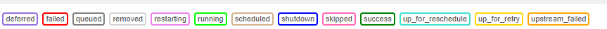

# Airflow

### 목차
- Airflow 설치 및 설정
- DAG 스케줄 설정
- Airflow UI
- 외부 연결
  - 데이터베이스 연결
- airflow를 `systemd` 로 설정
---

## Airflow 설치 및 설정

**가상환경**
```python
# 가상환경 생성
python -m venv airflow-venv

# 가상환경 활성화
source airflow-venv/bin/activate
```

**airflow 설치 - pip**
```python
# airflow 설치
$ pip install apache-airflow

# airflow 홈
$ export AIRFLOW_HOME=~/airflow
```

**airflow db init**
```python

# airflow 데이터베이스 초기화
$ airflow db init
```

**airflow 설치 후 어드민 생성**
```python
# 관리자 권한 생성
$ airflow users create \
    --username admin \
    --password admin \
    --firstname admin \
    --lastname admin \
    --role Admin \
    --email ithingv34@gmail.com
```

**airflow 설치 후 웹 인터페이스 실행**
```
$ airflow webserver --port 8080 

# 백그라운드로 실행
$ airflow webserver --port 8080 -D

# 프로세스 종료 시
$ sudo kill -9 $(sudo lsof -t -i:8080)
```
- 시간 설정 - `KST`


**airflow 설치 후 스케줄러 실행**
```
$ airflow scheduler
```

**airflow 환경설정**
```
$ airflow.cfg
```

**Hello Airflow 만들기**
- DAG의 위치 - `~/airflow/dags`
```python
from datetime import timedelta

import pendulum
from airflow.models import DAG
from airflow.operators.bash import BashOperator

with DAG(
    dag_id="hello_dag_v1",
    schedule_interval='1 * * * *',
    dagrun_timeout=timedelta(minutes=1),
    start_date=pendulum.datetime(2023, 2, 15, tz="Asia/Seoul"),
    max_active_runs=1,
    max_active_tasks=1,
    catchup=False
) as dag:
    bash_operator = BashOperator(
    task_id="hell_task",
    bash_command="echo Hello, Airflow",
    )

bash_operator
```
----
## DAG 스케줄 설정
- [Crontab 참고 사이트](https://crontab.guru/)

**반복**
```python
dag=DAG(
    dag_id = "dag_sample",
    start_date = dt.datetime(2023,01,01),
    schedule_interval = "@daily"
)
```

**시작날짜**
```python
dag=DAG(
    dag_id = "dag_sample",
    start_date = dt.datetime(2023,01,01),
    schedule_interval = None
)
```

**종료날짜**
- 옵션 설정
```python
dag=DAG(
    dag_id = "dag_sample",
    start_date = dt.datetime(2023,01,01),
    end_date=dt.datetime(2023,01,31),
    schedule_interval = None
)
```

**빈도 기반 스케줄**
```python
# 2분 간격 실행하기
schedule_interval=dt.timedelta(minutes=2)

# 2시간 간격 실행
schedule_interval=dt.timedelta(hours=2)

# 2일 간격 실행
schedule_interval=dt.timedelta(days=2)

# 예시
# 1월 1일 부터 31일 까지 2일 간격으로 작업 실행
dag=DAG(
    dag_id="hello_sample",
    start_date=dt.datetime(2023,01,01),
    end_date=dt.datetime(2023,01,30),
    schedule_interval=dt.timedelta(days=2),
)

```
**스케줄 편의 프리셋**
- 스케줄을 쉽게 설정하는 예약어

|preset| meaning| cron|
|-----|---|---|
|`None`| 외부 트리거에 의해서 실행||
|`@once`| 한번만 예약||
|`@hourly`| 한 시간에 한번씩 정시에 실행| `0 * * * *`|
|`@daily` | 하루에 한번 자정에 실행 |`0 0 * * *`|
|`@weekly` |일주일에 한 번 일요일 아침 자정에 실행| `0 0 * * 0`|
|`@monthly` | 매월 1일 자정에 한번 실행 | `0 0 1 * *`|
|`@yearly` | 매년 1월 1일 자정에 한번 실행| `0 0 1 1 *`|

**Backfill**
- DAG의 `catchup` 파라미터에 의해 설정 (True/False)
- 실행한 적이 없는 과거의 스케쥴을 예약하고 실행
- 잘못 설정하면 아주 오래 전 과거부터 실행(주의)
- 원천 소스에 의존적 - 데이터가 없을 수 있음
- 중간 데이터 처리는 가능 - 이미 실행된 데이터 파티션은 적재된 상태
  
```python
dag=DAG(
    dag_id="hello_backfill_sample",
    schedule_interval="@daily",
    start_date=dt.datetime(year=2023, month=1, day=1),
    catchup=False,
)
```


**Task 인스턴스의 상태 목록**
- 태스크가 실행 후 테스크 인스턴스의 상태 목록


|태스크 인스턴스 상태 |상태 설명|
|------|-----|
|`none`| 태스크 미대기, 의존성 미충족|
|`scheduled`| 작업의 의존성 충족, 스케줄러가 실행해야 한다고 예약|
|`queued` | 태스크가 워커에 할당, 워커를 기다림|
|`running` | 실행 중|
|`success` | 에러 없이 태스트 실행 완료|
|`shutdown` |실행 중인 태스크를 종료하도록 외부에서 요청|
|`restarting`| 실행 중인 태스크를 재시작하도록 외부에서 요청|
|`failed`| 실패, 작업에 실행 중 오류가 발생|
|`skipped` | 작업을 건너뜀|
|`upstream_failed` | 업스트림 작업이 실패, 트리거 규칙 필요.|
|`up_for_retry` | 작업이 실패했지만 재시도 횟수가 남아 있으며 다시 예약|
|`up_for_reschedule` | 일정 변경 모드|
|`deferred`| 작업이 트리거로 연기|
|`removed` |실행이 시작된 이후 작업이 DAG에서 삭제됨|

---
## 외부 연결
  
**1. Mysql 연결을 위한 패키지 설치**

```bash
pip install apache-airflow[mysql]
```

  - WSL 환경에서 `mysql_config`와 `mariadb_config`를 찾을 수 없다는 에러가 발생하여 MySQL 또는 MariaDB의 클라이언트 라이브러리를 설치해야했다.
      ```bash
      sudo apt-get update
      sudo apt-get install default-libmysqlclient-dev
      ```

**2. Airflow UI에서 `Admin` -> `Connections` -> `+` 버튼을 클릭하여 연결 정보를 입력한다.** 

- DB 정보 입력하고 연결을 테스트한다. 

- 테스트를 위해 mysql에 접속하여 데이터베이스와 샘플 데이터를 입력한다. 이때 schema로 설정한 값은 mysql에서 사용할 데이터베이스이다. 
 

**3. dag 작성**
- 아래의 dag 파일을 `~/airflow/dags` 폴더 아래에 저장한다.

```python
import pendulum
from airflow import DAG
from airflow.providers.mysql.operators.mysql import MySqlOperator
from airflow.operators.bash import BashOperator
from datetime import datetime, timedelta


with DAG(
    dag_id="mysql_dag_v1",
    schedule_interval='1 * * * *',
    dagrun_timeout=timedelta(minutes=1),
    start_date=pendulum.datetime(2023, 4, 17, tz="Asia/Seoul"),
    max_active_runs=1,
    max_active_tasks=1,
    catchup=False
) as dag:

    # 실행할 sql 문
    sql_query = "SELECT * FROM airflow_db.person"
    
    # MySqlOperator 정의
    mysql_operator = MySqlOperator(
        task_id='run_query',
        mysql_conn_id='rds_mysql',
        sql=sql_query,
        dag=dag
    )
    
    # 결과를 출력하는 bash opeartor
    output_result = BashOperator(
        task_id='output_result',
        bash_command='echo {{ ti.xcom_pull(task_ids="run_query") }}',
        dag=dag
    )
    
    # 작업 실행 순서
    mysql_operator >> output_result

```

**4. 결과 확인**

- 스케줄러에 의해 dags 폴더에 저장된 dag는 자동으로 DAGs 파이프라인에 업로드된다. 

- 작업이 성공적으로 실행되면 output_log에서 결과를 확인할 수 있다.

  