# Airflow 개념

**개요**
- [Airbnb](https://apache.googlesource.com/airflow-on-k8s-operator/+/HEAD/docs/design.md) 개발
- 2016년 아파치 재단 incubaor program
- 현재 아파치 탑레벨 프로젝트

**기존 방식의 문제점**
1. 실패 복구
    언제 어떻게 다시 실행할 것인가?
2. 모니터링
    파이프라인이 잘 돌아가고 있는지 확인하기 어려움
3. 의존성 관리
   파이프라인간 의존성이 있는 경우 상위 데이터 파이프라인이 잘 돌아가고 있는지 파악이 어려움
4. 확장성
   중앙화 해서 관리하는 툴이 없기 때문에 분산된 환경에서 파이프라인들을 관리하기 어려움
5. 배포
    새로운 워크 플로우를 배포하기 어려움

**워크플로우**

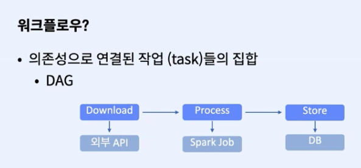

- 웹서버: 웹 대시보드 UI
- 스케줄러: 워크플로우가 **언제** 실행되는지 관리
- 메타스토어: 메타데이터 관리
- 익스큐터: 태스크가 **어떻게** 실행되는지 정의
- 워커: 태스트를 **실행**하는 프로세스

**오퍼레이터**
- 작업(Task)을 정의하는데 사용
- 다양한 오퍼레이터들이 존재하며 커스텀하게 만들 수도 있음
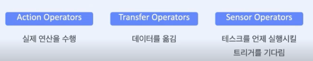


**Multi-Node Architecture**

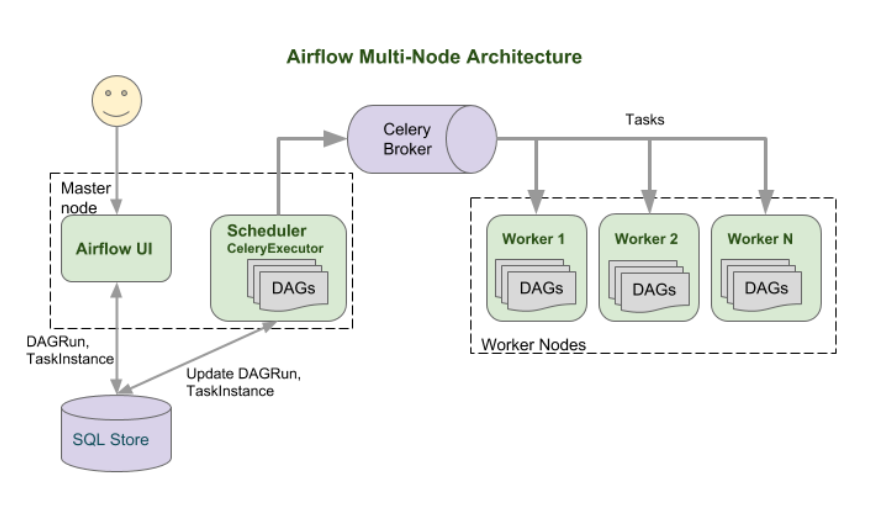


**동작방식**
1. DAG를 작성하여 Workflow를 만든다. DAG는 Task로 구성되어 있다.
2. Task는 Opeartor가 인스턴스화 된 것
3. DAG를 실행시킬 때 Scheduler는 DagRun 오브젝트를 만든다.
4. DagRun 오브젝트는 Task Instance를 만든다.
5. Worker가 Task를 수행 후 DagRun의 상태를 **완료**로 바꿔놓는다.

**DAG의 생성과 실행**


<div style="display: grid; grid-template-columns: repeat(2, 1fr); grid-gap: 20px; justify-items: center;">
    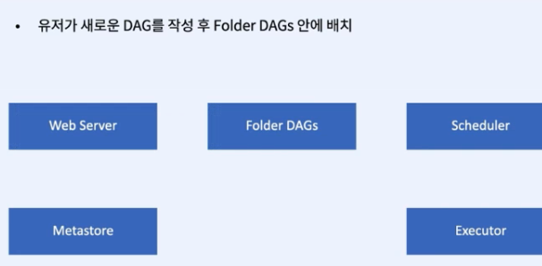
    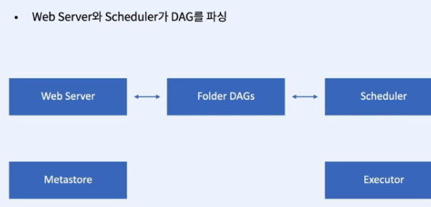
    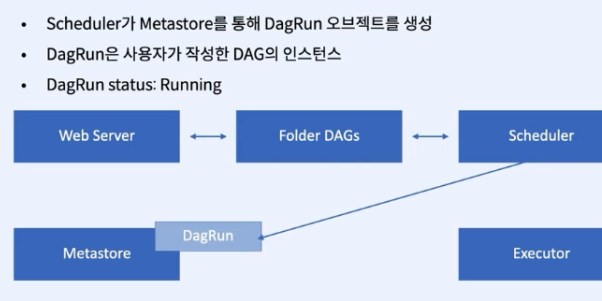
    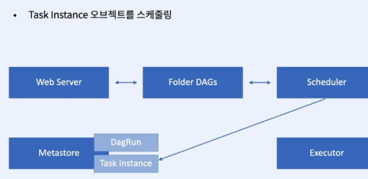
    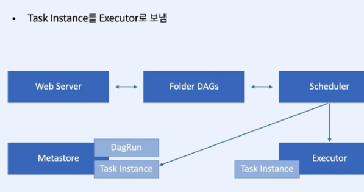
    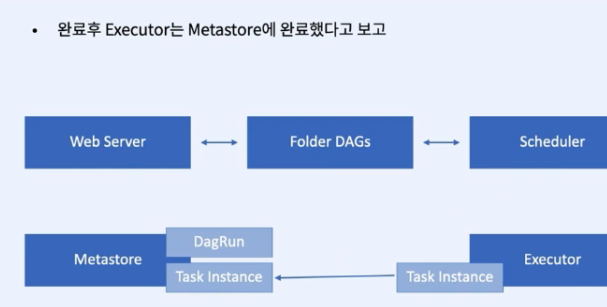
    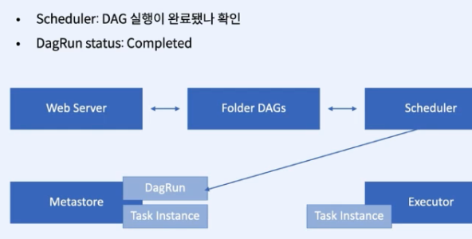
    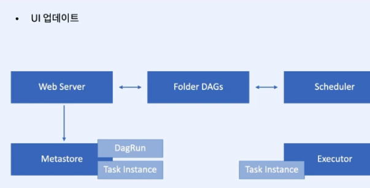
</div>

---

**내장 Operator**
- BashOperator
- PythonOpeartor
- EmailOperator

**외부 Operator**
- Action Operator

1. Action Operator는 액션을 실행한다.
2. Transfer Operator는 데이터를 옮길 때 사용한다.
3. Sensors: 조건이 맞을떄까지 기다린다.

[**다양한 providers**](https://airflow.apache.org/docs/apache-airflow-providers/packages-ref.html)
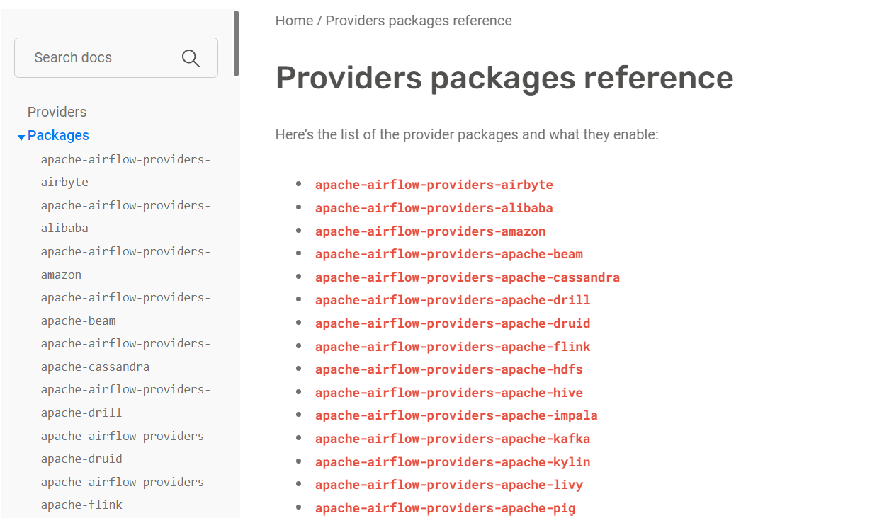

---

## DAG 스케줄 설정
- [Crontab 참고 사이트](https://crontab.guru/)

**반복**
```python
dag=DAG(
    dag_id = "dag_sample",
    start_date = dt.datetime(2023,01,01),
    schedule_interval = "@daily"
)
```

**시작날짜**
```python
dag=DAG(
    dag_id = "dag_sample",
    start_date = dt.datetime(2023,01,01),
    schedule_interval = None
)
```

**종료날짜**
- 옵션 설정
```python
dag=DAG(
    dag_id = "dag_sample",
    start_date = dt.datetime(2023,01,01),
    end_date=dt.datetime(2023,01,31),
    schedule_interval = None
)
```

**빈도 기반 스케줄**
```python
# 2분 간격 실행하기
schedule_interval=dt.timedelta(minutes=2)

# 2시간 간격 실행
schedule_interval=dt.timedelta(hours=2)

# 2일 간격 실행
schedule_interval=dt.timedelta(days=2)

# 예시
# 1월 1일 부터 31일 까지 2일 간격으로 작업 실행
dag=DAG(
    dag_id="hello_sample",
    start_date=dt.datetime(2023,01,01),
    end_date=dt.datetime(2023,01,30),
    schedule_interval=dt.timedelta(days=2),
)

```
**스케줄 편의 프리셋**
- 스케줄을 쉽게 설정하는 예약어

|preset| meaning| cron|
|-----|---|---|
|`None`| 외부 트리거에 의해서 실행||
|`@once`| 한번만 예약||
|`@hourly`| 한 시간에 한번씩 정시에 실행| `0 * * * *`|
|`@daily` | 하루에 한번 자정에 실행 |`0 0 * * *`|
|`@weekly` |일주일에 한 번 일요일 아침 자정에 실행| `0 0 * * 0`|
|`@monthly` | 매월 1일 자정에 한번 실행 | `0 0 1 * *`|
|`@yearly` | 매년 1월 1일 자정에 한번 실행| `0 0 1 1 *`|

**Backfill**
- DAG의 `catchup` 파라미터에 의해 설정 (True/False)
- 실행한 적이 없는 과거의 스케쥴을 예약하고 실행
- 잘못 설정하면 아주 오래 전 과거부터 실행(주의)
- 원천 소스에 의존적 - 데이터가 없을 수 있음
- 중간 데이터 처리는 가능 - 이미 실행된 데이터 파티션은 적재된 상태
  
```python
dag=DAG(
    dag_id="hello_backfill_sample",
    schedule_interval="@daily",
    start_date=dt.datetime(year=2023, month=1, day=1),
    catchup=False,
)
```
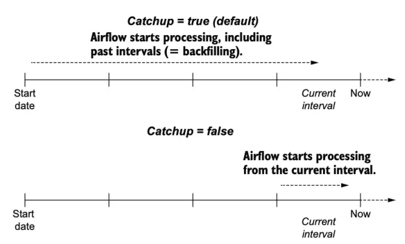

**Task 인스턴스의 상태 목록**
- 태스크가 실행 후 테스크 인스턴스의 상태 목록


|태스크 인스턴스 상태 |상태 설명|
|------|-----|
|`none`| 태스크 미대기, 의존성 미충족|
|`scheduled`| 작업의 의존성 충족, 스케줄러가 실행해야 한다고 예약|
|`queued` | 태스크가 워커에 할당, 워커를 기다림|
|`running` | 실행 중|
|`success` | 에러 없이 태스트 실행 완료|
|`shutdown` |실행 중인 태스크를 종료하도록 외부에서 요청|
|`restarting`| 실행 중인 태스크를 재시작하도록 외부에서 요청|
|`failed`| 실패, 작업에 실행 중 오류가 발생|
|`skipped` | 작업을 건너뜀|
|`upstream_failed` | 업스트림 작업이 실패, 트리거 규칙 필요.|
|`up_for_retry` | 작업이 실패했지만 재시도 횟수가 남아 있으며 다시 예약|
|`up_for_reschedule` | 일정 변경 모드|
|`deferred`| 작업이 트리거로 연기|
|`removed` |실행이 시작된 이후 작업이 DAG에서 삭제됨|