# GCP 환경에서 Airflow 환경 구축 - GCP에서 서버리스 영화 랭킹 구축

**목차**
- GKE에 쿠버네티스 클러스터 설치
- Helm을 사용하여 Airflow 배포 및 설정
- GCP LoadBalancer를 통해 Airflow webserver 포트 노출
- Git-sync 기능을 사용하여  Airlow Dag를 자동으로 동기화 설정
- Artifact Registry로 Airflow 의존성 관리

----
### GKE에 쿠버네티스 클러스터 설치

- gcloud CLI를 사용하여 GKE 클러스터를 생성한다.
    - [Gcloud를 설치하지 않은 경우 이 문서를 참고](https://github.com/ithingv34/GCP/blob/main/first-setup/auth1.md)

```bash
# gcloud service 활성화
gcloud services enable container.googleapis.com

# gke를 생성하는 명령어
gcloud container clusters create [CLUSTER_NAME] \
    --zone=[COMPUTE_ZONE] \
    --num-nodes=[NUM_NODES] \
    --machine-type=[MACHINE_TYPE]

# 예시
gcloud container clusters create cluste-1 \
    --machine-type n1-standard-4 \
    --num-nodes 1 \
    --region us-central1

# 설치한 GKE 리스트 
$ gcloud container clusters list
NAME       LOCATION       MASTER_VERSION   MASTER_IP      MACHINE_TYPE   NODE_VERSION     NUM_NODES  STATUS
cluster-1  us-central1-c  1.25.7-gke.1000  34.67.218.228  n1-standard-4  1.25.7-gke.1000  1          RUNNING

# Google Kubernetes Engine(GKE) 클러스터의 엔드포인트와 인증 데이터를 가져오기
# kubectl client를 클러스터에 연결
$ gcloud container clusters get-credentials cluster-1 --zone us-central1-c --project engaged-aviary-384322
Fetching cluster endpoint and auth data.
kubeconfig entry generated for cluster-1.

```
- 도중 gke-gcloud-auth-plugin 관련한 에러가 난다면 [이 문서](https://github.com/actions/runner-images/issues/6778)를 참고
---

### Helm을 사용하여 Airflow 배포 및 설정

```bash
# Airflow 소스코드 다운로드
$ curl -OL https://github.com/apache/airflow/archive/master.zip

# 압축 해제
$ unzip master.zip

# Airflow용 쿠버네티스 네임스페이스 생성
$ kubectl create ns airflow
namespace/airflow created

# helm 설치
$ curl https://raw.githubusercontent.com/kubernetes/helm/master/scripts/get-helm-3 | bash

# helm 버전
$ helm version
version.BuildInfo{Version:"v3.11.3", GitCommit:"323249351482b3bbfc9f5004f65d400aa70f9ae7", GitTreeState:"clean", GoVersion:"go1.20.3"}

# 로컬 Helm 리포지토리에 Apache Airflow용 공식 Helm 차트를 설치
$ helm repo add apache-airflow https://airflow.apache.org

# 차트가 로컬 리포지토리에 있는지 확인
$ helm repo list
NAME            URL
apache-airflow  https://airflow.apache.org

# Airflow를 GKE에 배포
$ helm upgrade --install airflow apache-airflow/airflow -n airflow --debug

```
- 정상적으로 설치를 완료했다면 다음 화면을 볼 수 있다.
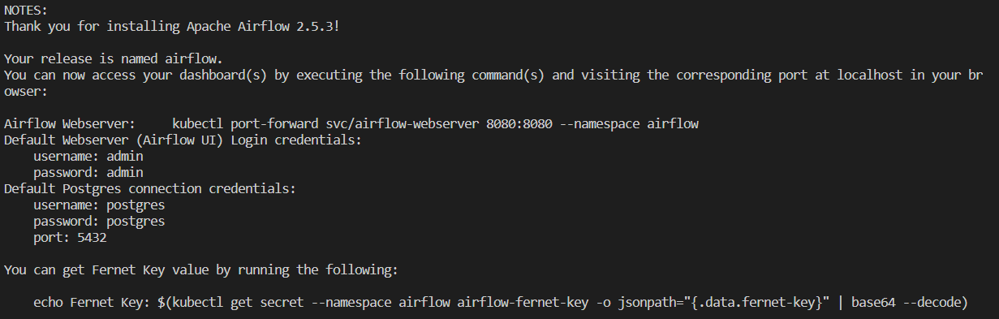
- GKE의 탭에 들어가 생성된 리소스 목록을 볼 수 있다.
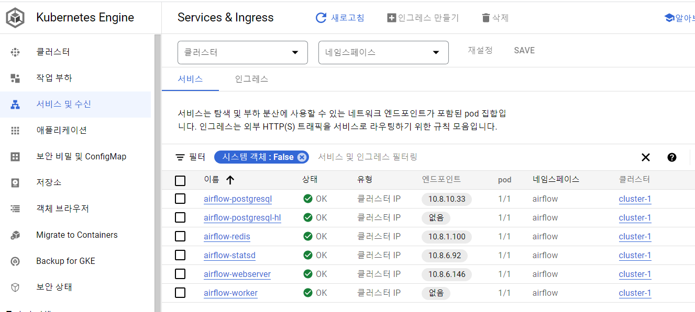

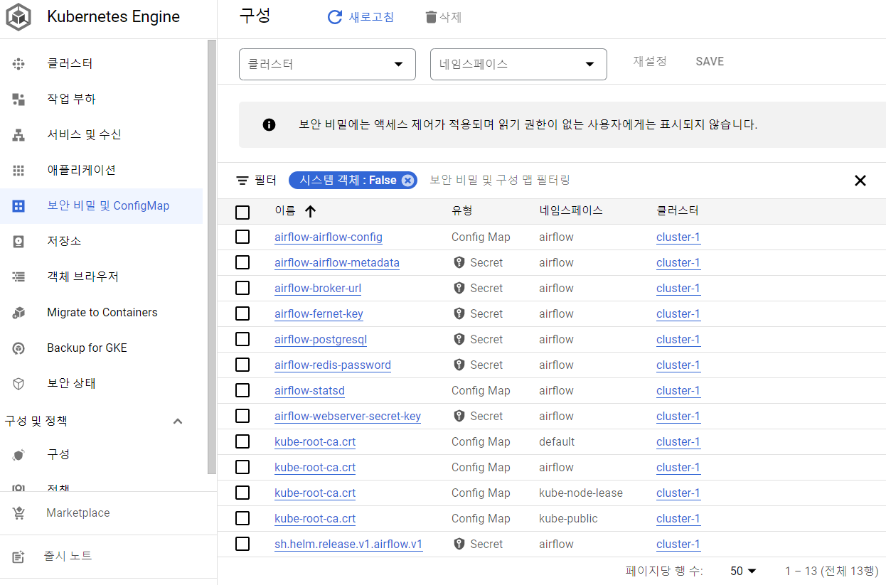

- 외부에서 웹서버에 접속할 수 있도록 포트포워딩 설정
```bash
$ kubectl port-forward svc/airflow-webserver 8080:8080 --namespace airflow
```
- 로그인을 완료하면 이 화면을 볼 수 있다
  - id: `admin`, pw: `admin`
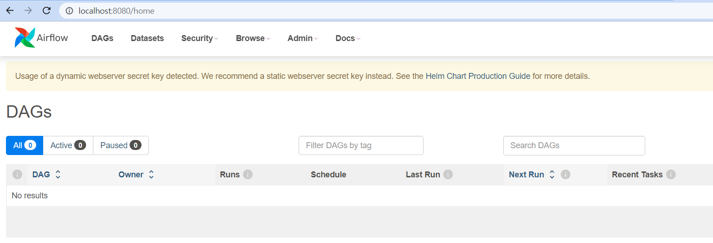

---

### GCP LoadBalancer를 통해 Airflow webserver 포트 노출

- 웹 서버의 서비스 타입이 **ClusterIP**로 설정되어 있어 이것을 LoadBalancer 타입으로 변경시켜 웹 서버를 외부에 노출 시킬 수 있다.
ClusterIP Type의 서비스는 외부의 요청을 적합한 파드로 라우팅할 수 있지만 외부에 연결할 엔드포인트를 제공하지 않는다. 이때 이용할 옵션 중 `LoadBalancer`를 생성하는 방법이 있다.

- `values.yaml` 파일을 수정하여 변경된 helm을 배포한다.
```bash
helm show values apache-airflow/airflow > values.yaml
```
- CluterIP -> LoadBalancer로 변경
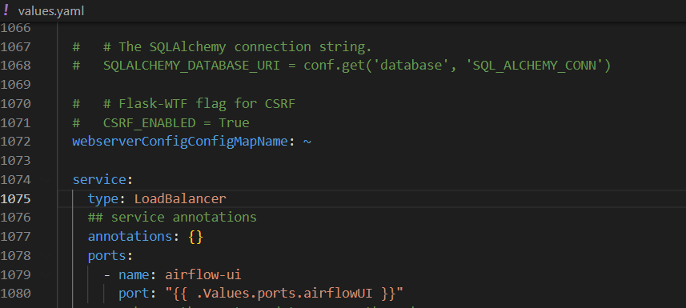


- helm 업그레이드
```bash
helm upgrade --install airflow apache-airflow/airflow -n airflow  -f values.yaml --debug
```
- GKE의 Services & Ingress 탭에 들어가보면 서비스 타입이 클러스터 IP 에서 외부 부하 분산기로 변경된 것을 확인할 수 있다.
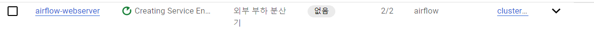

---
### Git-sync 기능을 사용하여  Airlow Dag를 자동으로 동기화 설정

- 이번 파트의 목적은 Github 저장소로 새로운 dag 코드를 push하면 airflow 스케줄러가 변경 사항을 자동으로 업데이트 할 수 있도록 gitSync 기능을 사용하는 것이다. 이를 위해 다음의 작업이 필요하다.
  - github repository 생성 및 ssh 키 설정
  - dag 폴더 생성 후 저장소에 push 하기
  - airflow와 git-sync 를 위한 쿠버네티스 Secret 오브젝트 생성
  - `values.yaml` 파일에 `gitSync` 의 내용을 수정
  - 변경 사항을 webserver 웹서버에서 확인하기


1. github repository 생성 및 ssh 키 설정

  - dag를 저장할 github 저장소를 생성하고 저장소 settings의 Deploy keys에서 생성한 ssh 공개키를 등록한다.
    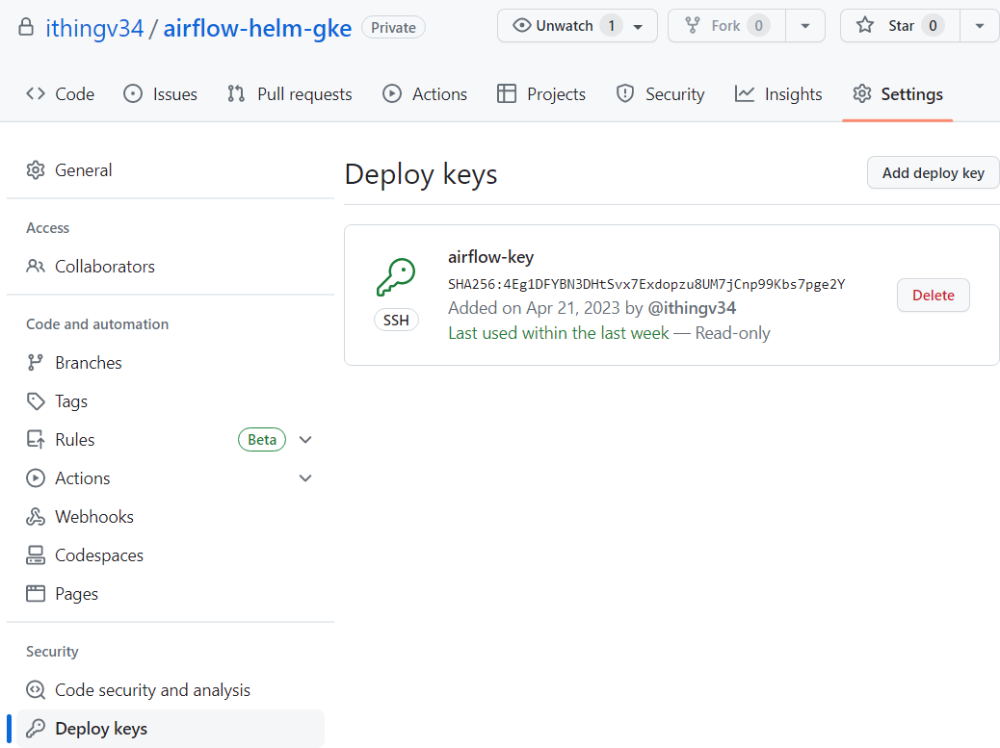

2. dag 폴더 생성 후 저장소에 push 하기
    - 테스트를 위해 dags 폴더 아래에 간단한 dag를 작성하고 저장소에 push한다.
    ```python
    from airflow import DAG
    from airflow.operators.bash_operator import BashOperator
    from datetime import datetime

    default_args = {
        'owner': 'airflow',
        'depends_on_past': False,
        'start_date': datetime(2023, 4, 21),
        'retries': 0
    }

    dag = DAG('git-sync-test_dag', default_args=default_args, schedule_interval='@once')

    task1 = BashOperator(
        task_id='task1',
        bash_command='echo "Hello World"',
        dag=dag
    )

    task2 = BashOperator(
        task_id='task2',
        bash_command='echo "Airflow is awesome!"',
        dag=dag
    )

    task1 >> task2
    ```
    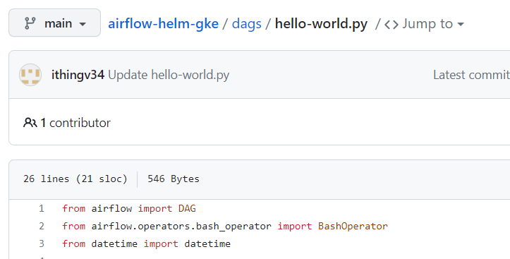
    


3.  airflow와 git-sync 를 위한 쿠버네티스 Secret 오브젝트 생성
    ```bash
    # airflow webserver pod를 찾기
    $ kubectl get pods -n airflow

    # secret 생성
    $ kubectl create secret generic airflow-ssh-git-secret --from-file=gitSshKey=<비밀키 경로> -n airflow

    # 생성된 secret 확인
    $ kubectl get secrets -n airflow
    ```

4.  `values.yaml` 파일에 `gitSync` 의 내용을 수정
    - helm 배포를 위해 아래 내용을 변경해준다.
    ```bash
    gitSync:
        enabled: true
        repo: <github repository ssh url>
        branch: main
        subPath: "dags"
        sshKeySecret: airflow-ssh-git-secret
    ```
    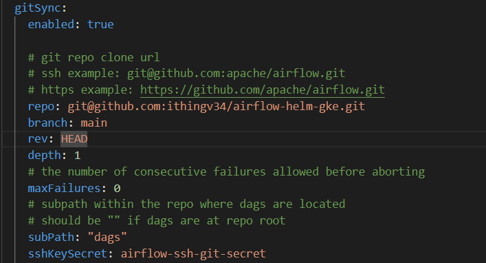
    
    - 파일을 저장하고 helm을 배포
    
    ```bash
    # helm 배포
    $ helm upgrade --install airflow apache-airflow/airflow -n airflow -f values.yaml --debug
    ``` 
5. 변경 사항을 webserver 웹서버에서 확인하기
    - pod를 조회하면 scheduler pod의 개수가 2 -> 3개로 변경됐음을 알 수 있다.
    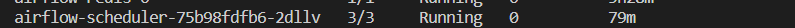
    - 이제 webserver에 접속하면 새로 등록된 dag를 확인할 수 있다.
    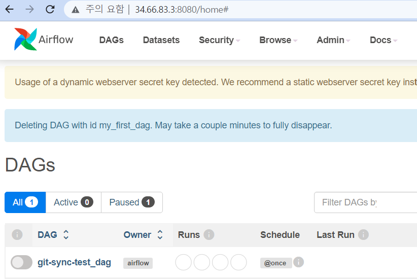
---
### Artifact Registry로 Airflow 의존성 관리

- 이번 파트는 docker를 사용하기 때문에 미리 docker 클라이언트를 설치해야한다.

`Helm`을 사용하여 쿠버네티스 클러스터에 애플리케이션을 배포할 때 `values.yaml` 파일을 사용하여 애플리케이션 구성을 정의한다. 애플리케이션의 Docker 이미지를 변경하려면 `values.yaml` 파일에서 이미지를 참조하는 값을 수정해야 한다.

```bash
# values.yaml 파일 중
image:
  repository: apache/airflow
  tag: 2.5.3
```
- `repository`와 `tag` 값은 Docker Hub에서 다운로드할 Airflow 이미지의 이름과 태그이다. 
- 새로운 이미지를 사용하려면, `repository`와 `tag` 값을 새로운 이미지의 이름과 태그로 변경해야한다. 
- 변경된 values.yaml 파일을 사용하여 Helm 차트를 업그레이드하면, Kubernetes 클러스터 내에서 새로운 Docker 이미지가 배포된다.
- 이를 위해 다음의 작업이 필요하다.
  - Docker Image 저장하고 배포하기 위한 플랫폼 중 하나인 `GCP Artifact Registry` 사용 설정하기, 비슷한 도구로 `AWS ECR`, `Harbor`, `Quay` 등이 있음
  - 새로운 도커 이미지 빌드 후 `Artifact Registry`로 배포
  - `values.yaml` 수정 후 Helm 업그레이드
  - 실행 중인 Pod에서 추가된 의존성 확인  

1. Docker Image 저장하고 배포하기 위한 플랫폼 중 하나인 `GCP Artifact Registry` 사용 설정 
  
- [Artifact Registry API를 사용 설정](https://cloud.google.com/artifact-registry?hl=ko)
  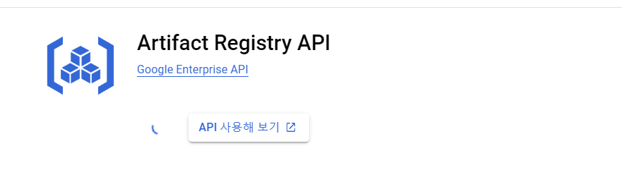
- gcloud 쉘에서 도커 이미지를 저장할 저장소를 생성
  
```bash
# GCP Artifact Registry에 로그인을 위한 docker client 인증파일 생성
$ gcloud auth configure-docker us-central1-docker.pkg.dev

# airflow-gke라는 이름으로 Docker 이미지 저장소를 생성
$ gcloud artifacts repositories create airflow-gke \        
--repository-format=docker \
--location=us-central1 \
--description="새로운 Airflow 이미지를 위한 docker 저장소" 
```

- 생성된 저장소 확인하기
    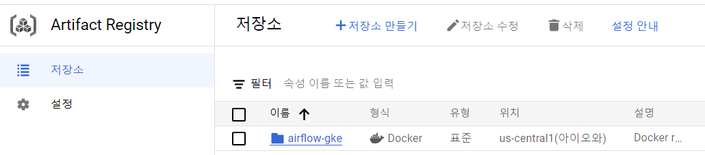

2. 새로운 도커 이미지 빌드 후 `Artifact Registry`로 배포

 - 현재 실행 중인 airflow 컨테이너의 provider 목록을 확인
 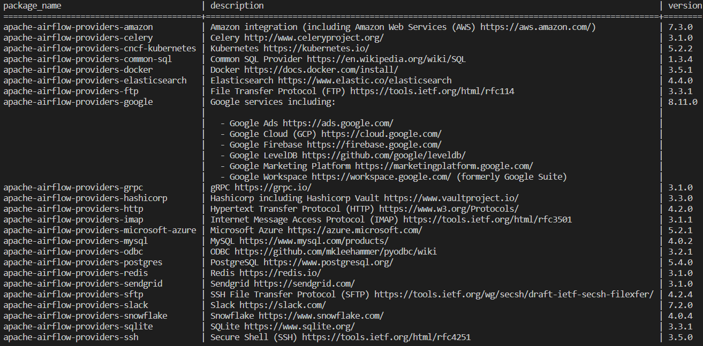
 
 - `Dockerfile` 파일 생성
    ```bash
    # Dockerfile
    FROM apache/airflow:2.5.3

    WORKDIR ${AIRFLOW_HOME}

    COPY requirements.txt .

    RUN pip3 install -r requirements.txt
    ``` 
 - `requirements.txt` 파일 생성
    - 테스트를 위해 mongodb provider를 설치 
    ```bash
    apache-airflow-providers-mongo==3.1.1
    ```
 - 현재 디렉토리 구조는 다음과 같다.
    ```bash
        .
        ├── Dockerfile
        ├── dags
        │   └── helloworld.py
        ├── requirements.txt
        └── values.yaml
    ```
  - 이미지 빌드 후 배포
    - `artifact-registry`에 도커 이미지를 배포하기 위해서 이름을 템플릿에 맞게 지정해야 한다.
    - `<region>-<docker>-pkg.dev`/`project-id`/`저장소 이름`/`이름:태그`
    ```bash
    # 빌드
    $ docker build -t us-central1-docker.pkg.dev/engaged-aviary-384322/airflow-gke/airflow-plugins-dependencies:1.0.0 .

    # 푸쉬
    $ docker push us-central1-docker.pkg.dev/engaged-aviary-384322/airflow-gke/airflow-plugins-dependencies:1.0.0
    ```
  - 결과 확인
     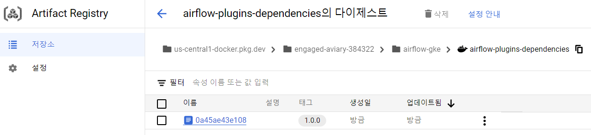  

3. `values.yaml` 수정 후 Helm 업그레이드

  - 수정된 도커 이미지를 사용하도록 `values.yaml` 파일을 수정해야한다.

    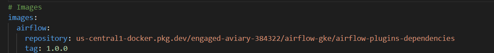
  - Helm upgrade 
    ```bash
    $ helm upgrade --install airflow apache-airflow/airflow -n airflow  -f values.yaml --debug
    ```


4. 실행 중인 Pod에서 추가된 의존성 확인 

- airflow 의존성 리스트를 확인하기
  ```bash
  # webserver pod 확인
  $ kubectl get pods -n airflow
    airflow-webserver-8bb484c7-tk8pj     1/1     Running   0          79m
  $ kubectl exec airflow-webserver-8bb484c7-tk8pj -n airflow -- airflow providers list 
  ``` 
- 이제 mongodb provider를 사용할 수 있다.
  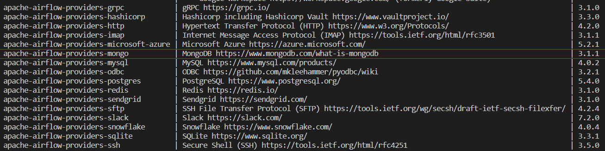
